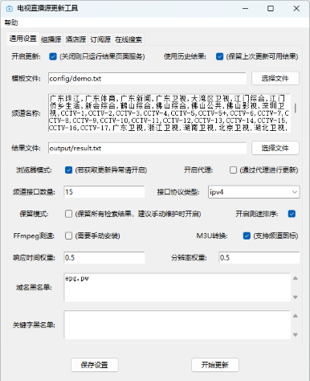
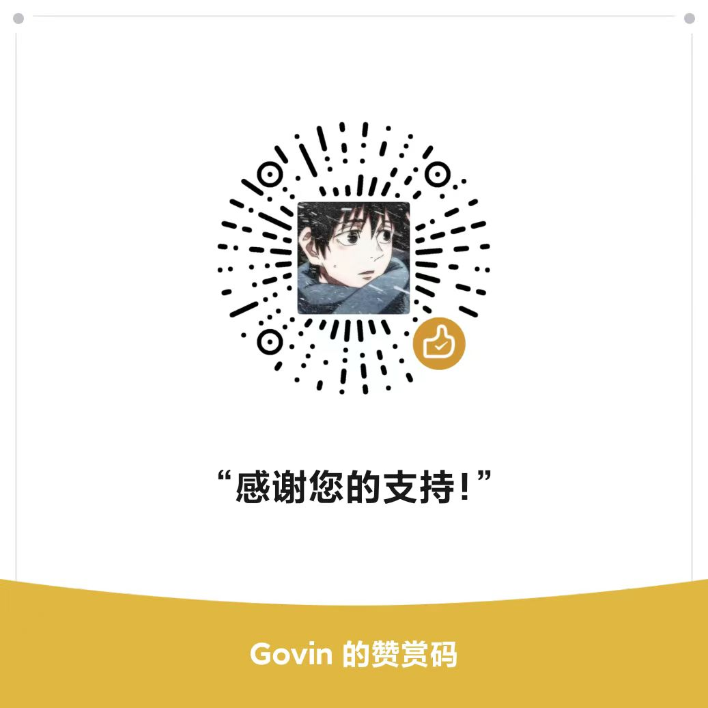

<div align="center">
  
  <h1 align="center">IPTV电视直播源更新工具</h1>
</div>

<div align="center">自定义频道菜单，根据模板频道，自动获取并更新最新的直播源接口，测速校验后生成可用的接口文件</div>
<div align="center">默认结果包含：📺央视频道、💰央视付费频道、📡卫视频道、🏠广东频道、🌊港·澳·台频道、🎬电影频道、🎥咪咕直播、🏀体育频道、🪁动画频道、🎮游戏频道、🎵音乐频道、🏛经典剧场</div>

<details>
  <summary>具体频道</summary>
  <div>
  📺央视频道: CCTV-1, CCTV-2, CCTV-3, CCTV-4, CCTV-5, CCTV-5+, CCTV-6, CCTV-7, CCTV-8, CCTV-9, CCTV-10, CCTV-11, CCTV-12, CCTV-13, CCTV-14, CCTV-15, CCTV-16, CCTV-17, CETV1, CETV2, CETV4, CETV5
  </div>
  <br>
  <div>
  💰央视付费频道: 文化精品, 央视台球, 风云音乐, 第一剧场, 风云剧场, 怀旧剧场, 女性时尚, 高尔夫网球, 风云足球, 电视指南, 世界地理, 兵器科技
  </div>
  <br>
  <div>
  📡卫视频道: 广东卫视, 香港卫视, 浙江卫视, 湖南卫视, 北京卫视, 湖北卫视, 黑龙江卫视, 安徽卫视, 重庆卫视, 东方卫视, 东南卫视, 甘肃卫视, 广西卫视, 贵州卫视, 海南卫视, 河北卫视, 河南卫视, 吉林卫视, 江苏卫视, 江西卫视, 辽宁卫视, 内蒙古卫视, 宁夏卫视, 青海卫视, 山东卫视, 山西卫视, 陕西卫视, 四川卫视, 深圳卫视, 三沙卫视, 天津卫视, 西藏卫视, 新疆卫视, 云南卫视
  </div>
  <br>
  <div>
  🏠广东频道: 广东珠江, 广东体育, 广东新闻, 广东卫视, 大湾区卫视, 广州影视, 广州竞赛, 江门综合, 江门侨乡生活, 佛山综合, 深圳卫视, 汕头综合, 汕头经济, 汕头文旅, 茂名综合, 茂名公共
  </div>
  <br>
  <div>
  🌊港·澳·台: 翡翠台, 明珠台, 凤凰中文, 凤凰资讯, 凤凰香港, 凤凰卫视, TVBS亚洲, 香港卫视, 纬来体育, 纬来育乐, J2, Viutv, 三立台湾, 无线新闻, 三立新闻, 东森综合, 东森超视, 东森电影, Now剧集, Now华剧, 靖天资讯, 星卫娱乐, 卫视卡式
  </div>
  <br>
  <div>
  🎬电影频道: CHC家庭影院, CHC动作电影, CHC高清电影, 淘剧场, 淘娱乐, 淘电影, NewTV惊悚悬疑, NewTV动作电影, 黑莓电影, 纬来电影, 靖天映画, 靖天戏剧, 星卫娱乐, 艾尔达娱乐, 经典电影, IPTV经典电影, 天映经典, 无线星河, 星空卫视, 私人影院, 东森电影, 龙祥电影, 东森洋片, 东森超视
  </div>
  <br>
  <div>
  🎥咪咕直播: 咪咕直播1-45
  </div>
  <br>
  <div>
  🏀体育频道: CCTV-5, CCTV-5+, 广东体育, 纬来体育, 五星体育, 体育赛事, 劲爆体育, 爱体育, 超级体育, 精品体育, 广州竞赛, 深圳体育, 福建体育, 辽宁体育, 山东体育, 成都体育, 天津体育, 江苏体育, 安徽综艺体育, 吉林篮球, 睛彩篮球, 睛彩羽毛球, 睛彩广场舞, 风云足球, 足球频道, 魅力足球, 天元围棋, 快乐垂钓, JJ斗地主
  </div>
  <br>
  <div>
  🪁动画频道: 少儿动画, 卡酷动画, 动漫秀场, 新动漫, 青春动漫, 爱动漫, 中录动漫, 宝宝动画, CN卡通, 优漫卡通, 金鹰卡通, 睛彩少儿, 黑莓动画, 炫动卡通, 24H国漫热播, 浙江少儿, 河北少儿科教, 七龙珠, 火影忍者, 海绵宝宝, 中华小当家, 斗破苍穹玄幻剧, 猫和老鼠, 经典动漫, 蜡笔小新, 漫画解说
  </div>
  <br>
  <div>
  🎮游戏频道: 游戏风云, 游戏竞技, 电竞游戏, 海看电竞, 电竞天堂, 爱电竞
  </div>
  <br>
  <div>
  🎵音乐频道: CCTV-15, 风云音乐, 音乐现场, 音乐之声, 潮流音乐, 天津音乐, 音乐广播, 音乐调频广播
  </div>
  <br>
  <div>
  🏛经典剧场: 笑傲江湖, 天龙八部, 鹿鼎记, 仙剑奇侠传, 西游记, 三国演义, 水浒传, 新白娘子传奇, 天龙八部, 济公游记, 封神榜, 闯关东, 上海滩, 射雕英雄传
  </div>
</details>
<br>
<p align="center">
  <a href="https://github.com/Guovin/TV/releases/latest">
    
  </a>
  <a href="https://www.python.org/">
    
  </a>
  <a href="https://github.com/Guovin/TV/releases/latest">
    
  </a>
  <a href="https://hub.docker.com/repository/docker/guovern/tv-requests">
    
  </a>
   <a href="https://hub.docker.com/repository/docker/guovern/tv-driver">
    
  </a>
</p>

[English](./README_en.md) | 中文

## 特点

- 自定义模板，生成您想要的频道
- 支持多种获取源方式：组播源、酒店源、订阅源、关键字搜索
- 接口测速验效，响应时间、分辨率优先级，过滤无效接口
- 定时执行，北京时间每日 6:00 与 18:00 执行更新
- 支持多种运行方式：工作流、命令行、GUI 软件、Docker(amd64/arm64)
- 更多功能请见[配置参数](./docs/config.md)

## 最新结果：

- 接口源：

```bash
https://ghproxy.net/raw.githubusercontent.com/Guovin/TV/gd/output/result.m3u
```

- 数据源：

```bash
https://ghproxy.net/raw.githubusercontent.com/Guovin/TV/gd/source.json
```

## 配置

[配置参数](./docs/config.md)

## 快速上手

### 方式一：工作流更新

Fork 本项目并开启工作流更新，具体步骤请见[详细教程](./docs/tutorial.md)

### 方式二：命令行更新

```python
pip3 install pipenv
pipenv install
pipenv run build
```

### 方式三：GUI 软件更新

1. 下载[更新工具软件](https://github.com/Guovin/TV/releases)，打开软件，点击更新，即可完成更新

2. 或者在项目目录下运行以下命令，即可打开 GUI 软件：

```python
pipenv run ui
```



### 方式四：Docker 更新

- requests：轻量级，性能要求低，更新速度快，稳定性不确定（推荐订阅源使用此版本）
- driver：性能要求较高，更新速度较慢，稳定性、成功率高；修改配置 open_driver = False 可切换到 request 版本（推荐酒店源、组播源、关键字搜索使用此版本）

建议都试用一次，选择自己合适的版本。

```bash
1. 拉取镜像：
requests：
docker pull guovern/tv-requests:latest

driver：
docker pull guovern/tv-driver:latest

2. 运行容器：
docker run -d -p 8000:8000 guovern/tv-requests 或 tv-driver

卷挂载参数（可选）：
实现宿主机文件与容器文件同步，修改模板、配置、获取更新结果文件可直接在宿主机文件夹下操作

配置文件：
-v 宿主机路径/config:/tv-requests/config 或 tv-driver/config

结果文件：
-v 宿主机路径/output:/tv-requests/output 或 tv-driver/output

例：docker run -v /etc/docker/config:/tv-requests/config -v /etc/docker/output:/tv-requests/output -d -p 8000:8000 guovern/tv-requests

3. 查看更新结果：访问（域名:8000）
```

#### 注：方式一至三更新完成后的结果文件链接：http://本地 ip:8000 或 http://localhost:8000

## 更新日志

[更新日志](./CHANGELOG.md)

## 许可证

[MIT](./LICENSE) License &copy; 2024-PRESENT [Govin](https://github.com/guovin)

## 赞赏

<div>请我喝杯咖啡☕️吧~</div>

| 支付宝                                    | 微信                                        |
| ----------------------------------------- | ------------------------------------------- |
|  |  |

## 免责声明

本项目仅供学习交流用途，接口数据均来源于网络，如有侵权，请联系删除
